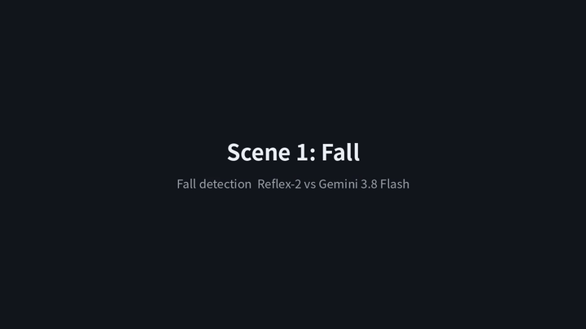
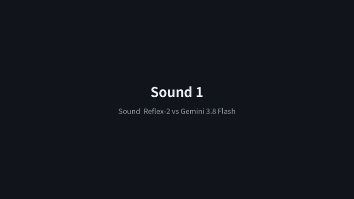
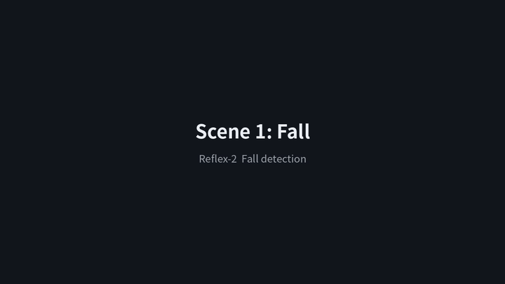
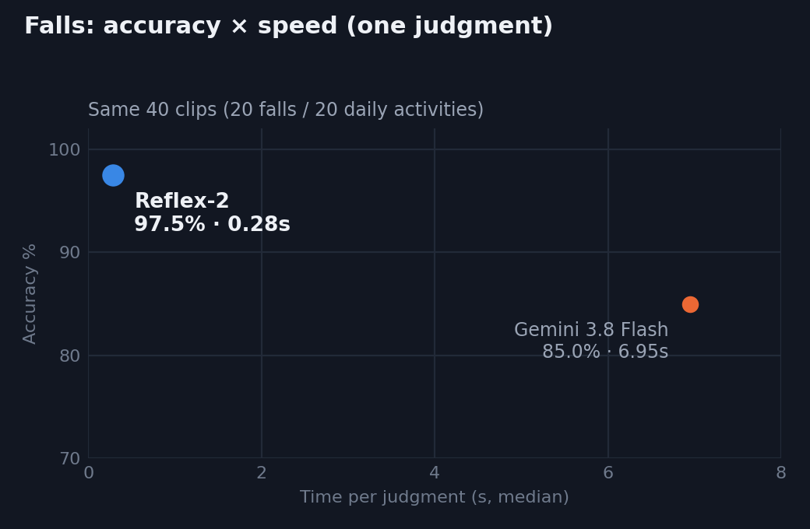
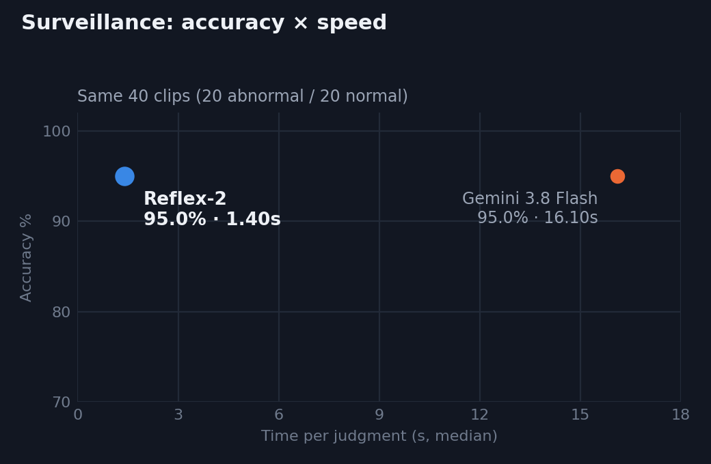
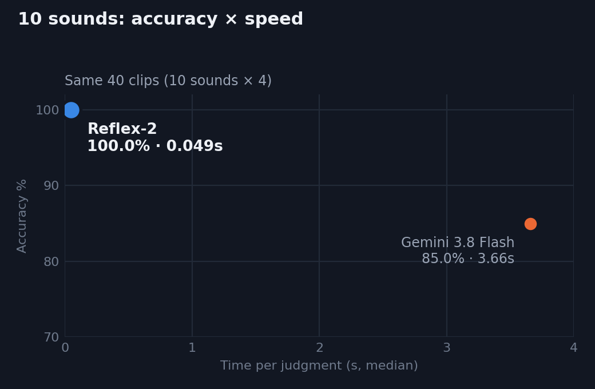
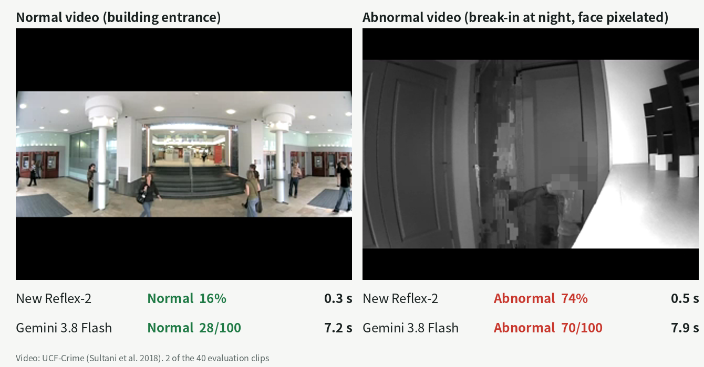

# Reflex-2

**Google EmbeddingGemma 2, improved into a video judgment model that runs on phones. Judges video at Jev speed with frontier-LLM-level accuracy or better.**

[EmbeddingGemma 2](https://blog.google/innovation-and-ai/technology/developers-tools/embeddinggemma-2/) (Google, Apache 2.0, 740M parameters) turns text, images, video and audio into one vector. It is a search model: as is, it cannot judge whether a clip shows a fall. Reflex-2 turns it into a judgment model by training a small head from examples, so it can tell, on the device, the moment something happens:

- **Falls**: caught 1.2 to 2.1 s after the person falls, while Gemini 3.8 Flash takes 8.3 s or misses it. 0.28 s per judgment on one GPU.
- **Surveillance anomalies**: the same accuracy as Gemini 3.8 Flash (95%), 11× faster.
- **Sounds** (crying baby, glass breaking, siren, alarm...): 100% vs 85% for Gemini on the same 40 clips, 0.05 s vs 3.66 s.
- **Video stays on the device.** 1.5 GB of weights, no per-call fee.

Reflex-2 is the video and audio sibling of [Reflex-1](https://github.com/matu79go/reflex-1) (text and images; answers a written question with no training). Use Reflex-1 when a judgment is described in words; use Reflex-2 when it is seen or heard and you can show examples.

[](https://colab.research.google.com/github/matu79go/reflex-2/blob/main/notebooks/quickstart.ipynb)
[](https://huggingface.co/matu79go/Reflex-2)

## Demos

**How fast does it notice that someone fell?** The clock starts at the moment of the fall. Both models judge the same frames (the last 4 s) ([full video](media/race2_en.mp4))



**Telling sounds apart.** Crying baby and glass breaking; Gemini calls the glass "footsteps" ([full video with sound](media/audio_en.mp4))



**Watching a home camera.** The line is the fall probability; the shaded band is the actual fall ([full video](media/fall_en.mp4))



## Results

All comparisons use the same inputs for both models: the same frames, the same 16 kHz audio. Reflex-2 uses heads trained on examples; Gemini 3.8 Flash is untrained, with thinking set to minimal (it cannot be turned off). Reflex-2 measured on one NVIDIA GB10 (ASUS Ascent GX10), Gemini via OpenRouter with network included, one clip at a time.

| Same 40 clips each | Gemini 3.8 Flash | **Reflex-2** |
|---|---|---|
| Falls vs daily activities | 85.0% | **97.5%** |
| Time per judgment (median) | 6.95 s | **0.28 s** |
| Surveillance: abnormal vs normal | 95% | 95% |
| Time per judgment (median) | 16.1 s | **1.4 s** |
| 10 sounds | 85% | **100%** |
| Time per judgment (median) | 3.66 s | **0.049 s** |

<p>



</p>

**Time from the fall to the alert** (watching the same clip like a camera; Reflex-2 checks the last 4 s every 0.5 s, Gemini sends the last 4 s again each time it answers)

| Scene | Fall starts | Gemini 3.8 Flash | **Reflex-2** |
|---|---|---|---|
| Falls from a chair | 3.4 s | 8.3 s after the fall | **1.9 s after the fall** |
| Walks and falls | 2.7 s | missed (all 4 answers "normal") | **2.1 s after the fall** |
| Falls forward | 2.6 s | missed (all 4 answers "normal") | **1.2 s after the fall** |
| Lies down on a bed (normal) | none | no alert | no alert |



## Training is what makes it work

Raw EmbeddingGemma 2 can only compare a clip with a text description, which is not enough for a judgment. Reflex-2 trains a head from examples. Accuracy on clips and sounds not used for training:

| Task | Examples | Training time | Raw EmbeddingGemma 2 | **Reflex-2** |
|---|---|---|---|---|
| Falls (people never seen in training) | about 120 | about 1 min | 53.8% | **95.7%** |
| Surveillance anomalies | 120 | about 3 min | 63.5% | **92.5%** |
| 10 sounds (ESC-50, official 5 folds) | 320 | about 30 s | 35% | **96.3%** |
| Voice emotion, 8 classes (speakers never seen) | 1,200 | about 1 min | 14% | **52%** |

Training time is embedding the examples on one GPU plus fitting the head (seconds on a CPU). Chance level: 50% for falls and surveillance, 10% for sounds, 12.5% for emotion. The released fall head was trained on all 160 GMDCSA24 clips. The surveillance head is not released, because UCF-Crime is for research use.

## Install

```bash
pip install -r requirements.txt
```

Python 3.10+, PyTorch 2.4+, sentence-transformers 6.1+. The first run downloads `google/embeddinggemma-2` (1.5 GB).

## Use

```python
from reflex2 import Reflex2

rf = Reflex2().load_heads("heads")              # heads/fall.json -> head "fall"
rf.decide("clip.mp4", "fall")
# {'choice': 'fall', 'confidence': 0.97, 'probs': {'adl': 0.03, 'fall': 0.97}, 'latency_ms': 290}

rf.watch("camera.mp4", "fall")                  # judge the last 4 s every 0.5 s
# [(1.0, {'adl': 0.96, 'fall': 0.04}), ..., (4.5, {'adl': 0.03, 'fall': 0.97}), ...]
```

**Train your own judgment** from labelled clips, images or audio files:

```python
head = rf.train_head({"glass": ["g1.wav", "g2.wav", ...], "other": ["o1.wav", ...]}, name="glass")
head.save("heads/glass.json")
```

or from the command line:

```bash
python scripts/train_head.py --out heads/my_head.json --label fall="clips/fall/*.mp4" --label normal="clips/normal/*.mp4"
python scripts/watch.py camera.mp4 --head heads/my_head.json --label fall
```

**HTTP endpoint** (same request shape as Reflex-1 and Jev):

```bash
python -m reflex2.server --heads heads --port 8098
```

```json
POST /v1/decisions
{"video": "clip.mp4",
 "questions": {"fall": {"type": "choice", "head": "fall"},
               "room": {"type": "choice", "instructions": "Where is this?",
                        "criteria": {"bedroom": "a bedroom", "kitchen": "a kitchen"}}}}
-> {"answers": {"fall": {"choice": "fall", "confidence": 0.97, "probs": {...}},
                "room": {"choice": "bedroom", "confidence": 0.95, "probs": {...}}}, "latency_ms": 300}
```

`video`, `image` and `audio` take a local path or base64; `state` takes text. One embedding serves every question in a request.

## How it works

1. **Embed.** Frames are sampled at 1 per second (up to 32, evenly over the clip; audio as a 16 kHz waveform) and EmbeddingGemma 2 turns the clip into one 768-d vector. The base weights are unchanged.
2. **Judge.** A head (a logistic regression over the vector, a few hundred kilobytes) returns the probability of each option. This is the standard linear-probe recipe; what is new is the base model, which reads video and audio and runs on phones.
3. **Watch.** For a live camera, `watch()` judges the last 4 s (2 frames per second) every 0.5 s.

One vector can feed many heads at once (fall, intrusion, glass breaking...), so adding a judgment costs almost nothing at inference time.

## Notes

- Judgments need a head trained on examples; raw EmbeddingGemma 2 does not judge reliably.
- Reflex-2 tells **when** something happens, not **who**. Combine it with a person detector to locate people.
- Evaluations use public data (staged falls, surveillance clips, sound effects). For your site, train the head on your own footage.

## License and credits

Code: Apache 2.0. Base model: Google EmbeddingGemma 2 (Apache 2.0); Reflex-2 is not affiliated with or endorsed by Google. The fall head is trained on GMDCSA24 (Data in Brief, 2024; MIT License). Comparison data: UCF-Crime (Sultani et al. 2018), ESC-50 (Piczak 2015, CC BY-NC 3.0), RAVDESS (Livingstone and Russo 2018, CC BY-NC-SA 4.0). Gemini 3.8 Flash results were measured by the author through OpenRouter. See `NOTICE`.

Japanese versions of the demos and charts are in `media/ja/`. Concept: NerveReflex.
